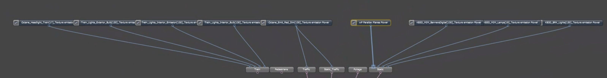
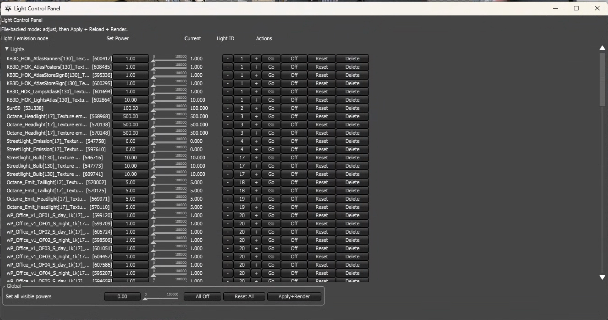

# Octane Standalone Scripts

Lua utilities for Octane Standalone scene setup, light control, batch rendering, render-layer cleanup, and node graph maintenance.

This folder is the active working copy for the public GitHub repo:

https://github.com/AlexPearce3D/OctaneStandaloneScripts

## Primary Light Workflow

### `expose_light_powers.lua`

Current version: `v0.4.07`

Exposes nested Texture emission controls up to parent node graphs by adding Float value controls and Float input linkers.

Highlights:

- Scans nested node graphs for material and light `emission` pins.
- Exposes emission `power` as parent-graph Float controls.
- Falls back to multiplying `efficiency or texture` when an emission node has no `power` pin.
- Resolves emission nodes connected before or after their material pin in the `.ocs` XML.
- Groups `wP...` parallax-plane emissions into a shared `wP Parallax Planes Power` control.
- Writes a `.exposed-emissions.bak` backup before modifying a scene.

### `light_control_panel.lua`

Current version: `v0.1.14`

Creates a floating light-control panel for Octane Standalone scenes.

Highlights:

- Scans the current scene and falls back to a file-backed `.ocs` scan when Octane's live Lua graph only exposes anonymous internals.
- Shows exposed Float controls created by `expose_light_powers.lua`.
- Traces exposed power controls back to their original Texture emission nodes for the `Go` action when possible.
- Includes daylight environment power controls.
- Supports per-row power sliders, off/reset/delete buttons, `Go` selection, and global all-off/reset.
- Adds single-line row separators and marks the last interacted row with a `>` prefix.
- Supports marking a target node for deletion, then writing/reloading with `Apply+Render`.
- Writes a `.lightpanel.bak` backup before modifying a scene.

## Screenshots

Exposed light controls collected at the parent graph:



Light control panel:



## Usage

Open a script in Octane Standalone's Lua script editor while a project is open and run it.

`expose_light_powers.lua` writes changes in place after creating a backup. To dry-run from command-line/script execution, pass:

```sh
--dry-run
```

`light_control_panel.lua` edits file-backed scene values in memory first. Use `Apply+Render` in the panel to write the scene, reload it, and restart rendering.

The first log line prints each maintained script version so you can confirm which copy Octane ran.

## Script Index

### Light Setup And AOV Tools

| Script | Purpose | Notes |
| --- | --- | --- |
| `expose_light_powers.lua` | Exposes nested emission powers to parent graphs as Float controls. | Primary setup script for the light panel. |
| `light_control_panel.lua` | Floating panel for adjusting exposed light powers and daylight environments. | Primary interactive control script. |
| `_ScanLightAOVs.lua` | Read-only Light AOV audit for the current project. | Reports used/unused Light IDs and missing AOVs. |
| `ChangeLightID.lua` | Changes selected light IDs. | Small selected-node utility. |
| `ChangeLightPower.lua` | Changes selected light power. | Original small light-power utility. |
| `ChangeLightPower_v02.lua` | Updated selected light-power utility. | Newer variant of `ChangeLightPower.lua`. |

### Render Layer And Visibility Utilities

| Script | Purpose | Notes |
| --- | --- | --- |
| `ChangeRenderLayerAndViz.lua` | Changes render layer and visibility settings. | Selection-based utility. |
| `ChangeRenderLayerTo1.lua` | Sets selected object layers to render layer 1. | Quick one-off helper. |
| `ChangeRenderLayerTo2.lua` | Sets selected object layers to render layer 2. | Quick one-off helper. |
| `ForSelected_TurnCamVizOff.lua` | Turns camera/general/shadow/dirt/curvature visibility off for selected Object Layer nodes. | Selection-based cleanup helper. |
| `IfCamVis_ChangeRenderLayer.lua` | If camera visibility is off, turns visibility back on and moves selected Object Layer nodes to render layer 3. | Selection-based utility. |

### Node Naming, Finding, And Cleanup

| Script | Purpose | Notes |
| --- | --- | --- |
| `AddNumberToNodes.lua` | Adds unique `_0001` style suffixes to selected nodes. | Skips nodes already numbered. |
| `AddNumberForSpecificNodes.lua` | Adds unique numeric suffixes only to selected nodes matching a configured name. | Default target is `Object layer`. |
| `FindNameAndDestroyAll.lua` | Deletes selected material nodes whose names contain a configured search term. | Destructive; review `searchTerm` before running. |
| `FindNameAndDestroyOne.lua` | Deletes matching selected material nodes. | Destructive; review `searchTerm` before running. |
| `FindTextureInRenderTarget.lua` | Walks a selected render target and prints texture filenames used by connected nodes. | Read-only inventory helper. |
| `FindMaterial_SetOpacity.lua` | Finds matching materials and changes opacity. | Review the configured search and value before running. |
| `FindMaterial_SetOpacityto1.lua` | Finds matching materials and sets opacity to 1. | Review configured search before running. |
| `CollapseExpandByType.lua` | Collapses or expands nodes by type. | Node graph visibility helper. |
| `ExpandNodeByType.lua` | Expands nodes of a configured type. | Node graph visibility helper. |

### Array And Placement Helpers

| Script | Purpose | Notes |
| --- | --- | --- |
| `LightArray.lua` | Creates an analytic sphere light and a line of placement/geo group instances. | Intended to run from an active node graph context. |
| `TransformArray.lua` | Offsets selected Transform Value nodes along a configurable axis with spacing and flip support. | Current transform-array utility. |
| `TransformArray_old.lua` | Older Transform Value offset helper. | Kept for reference. |

### Batch Render Scripts

| Script | Purpose | Notes |
| --- | --- | --- |
| `DefaultBatchRender.lua` | Batch render job script variant. | Legacy/custom Octane batch render job. |
| `AP_BatchRender.lua` | Batch render job script variant with frame order options. | Legacy/custom Octane batch render job. |
| `BatchRender_ORBX/Batch_Render_Job_Final.lua` | Batch render script packaged with ORBX instructions. | See `BatchRender_ORBX/README.txt`. |

Older `Batch_Render...` root-level variants have been moved to `zArchive/` so the active folder stays easier to scan.

### Launcher And API Probes

| Script | Purpose | Notes |
| --- | --- | --- |
| `ScriptLauncher.lua` | Runs a target script from likely Octane script folders and reports sandbox path issues. | Default target inside script is configurable. |
| `ProbeOctaneLuaAPI.lua` | Prints available Octane Lua API modules and GUI component keys. | Read-only diagnostic. |

## zArchive

`zArchive/` contains legacy or currently parked scripts. These are kept in the repo so they can be revisited later without cluttering the active script folder.

All root-level files that started with `Batch_Render` were archived here on June 30, 2026.

| Script | Notes |
| --- | --- |
| `zArchive/Batch_Render_Job_Final_1441_FINAL_FIXED_v2.lua` | Archived Batch_Render variant. Syntax check passed before archiving. |
| `zArchive/Batch_Render_Job_Final_CLEAN.lua` | Archived Batch_Render variant. `luac` reports `<eof> expected near 'else'` around line 175. |
| `zArchive/Batch_Render_Job_Final_CLEAN_v2.lua` | Archived Batch_Render variant. `luac` reports `<eof> expected near 'else'` around line 175. |
| `zArchive/Batch_Render_Job_Final_CLEAN_v3.lua` | Archived Batch_Render variant. Syntax check passed before archiving. |
| `zArchive/Batch_Render_Job_Lockfile_Only.lua` | Archived Batch_Render variant. Syntax check passed before archiving. |
| `zArchive/Batch_Render_Job_Render_Backwards_FINAL.lua` | Archived Batch_Render variant. `luac` reports `unexpected symbol near '{'` at line 1. |
| `zArchive/Batch_Render_Job_Render_Backwards_FINAL_CLEAN.lua` | Archived Batch_Render variant. Syntax check passed before archiving. |
| `zArchive/Batch_Render_Job_Render_Backwards_FINAL_CLEAN_v2.lua` | Archived Batch_Render variant. Syntax check passed before archiving. |
| `zArchive/Batch_Render_Job_Render_Backwards_FINAL_CLEAN_v3.lua` | Archived Batch_Render variant. Syntax check passed before archiving. |
| `zArchive/Batch_Render_Job_Render_Backwards_LOCKFILE.lua` | Archived Batch_Render variant. Syntax check passed before archiving. |

The broken entries above are documented rather than fixed because the current goal is preservation and cleanup, not batch-render refactoring.

## Screenshots For Other Scripts

The checked-in screenshots cover the two UI/node-graph workflows that can be meaningfully shown from outside Octane: exposed light controls and the light control panel. Most other scripts are selection-based utilities or batch-render job scripts that only show their effect inside a specific Octane scene, selection, or render job node. Their behavior is documented in the script index above instead of using generic screenshots.

## Validation

Most Lua files were syntax-checked with:

```sh
luac -p <script.lua>
```

Syntax validation only checks Lua syntax. Many scripts require Octane Standalone globals such as `octane`, a current project, selected nodes, or a script-node context to run correctly.
